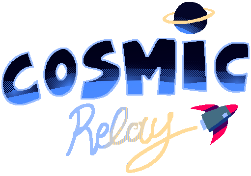
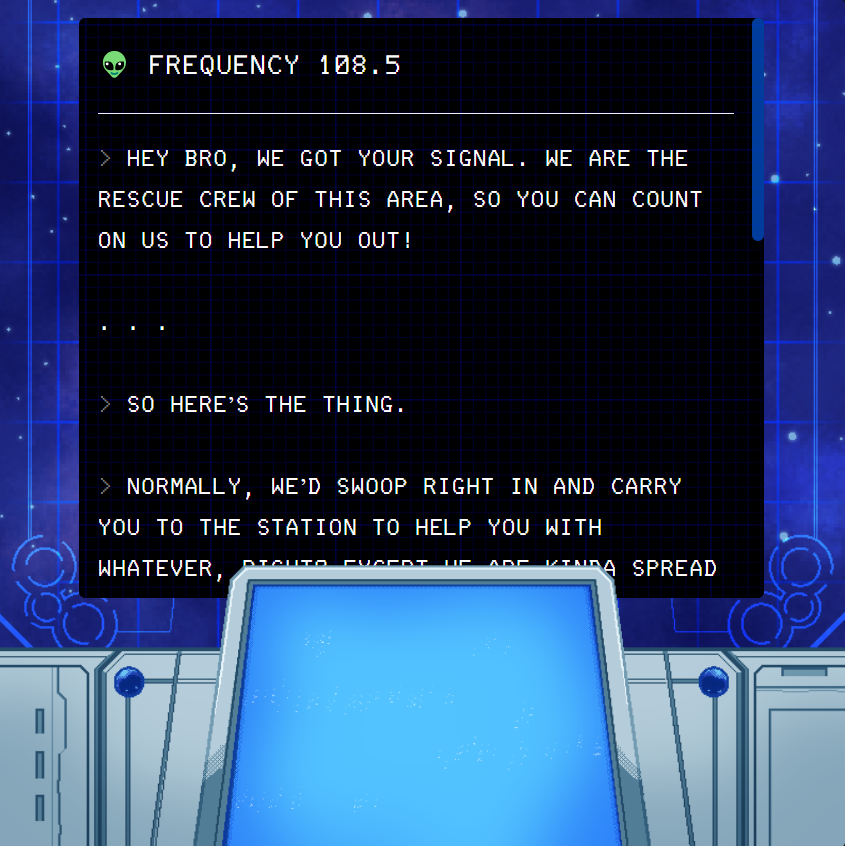

  

<h3 align="center">Cosmic Relay</h3>

## 📝 Table of Contents

* [About](#about)
* [Credits](#credits)
* [Contribution](#contribution)

## 🧐 About 

In Cosmic Relay you play as an unfortunate traveler trying to pick the right choices to make it out alive. "Right" being a relative term. You have to help your character survive through the dangerous space filled with pirates and aliens waiting just around the corner using just your screen and console.

## ❤️ Credits 

The sound effect for the loading text used is called "UI, Mechanical, Text-Scroll, 03, FX, 01, LOOP.wav" by InspectorJ ([www.jshaw.co.uk](http://www.jshaw.co.uk/)) retrieved from [https://freesound.org/people/InspectorJ/sounds/458587/](https://freesound.org/people/InspectorJ/sounds/458587/).

## 🎁 Contribution 

If you want to extend the functionality of the game, please don't hesitate to send me changes to approve. If you wish you can also fork it and work off of that. To learn how to work and contribute effectively to this game, head over to the documentation markdown file where I explain how I make changes to the code, test and deploy them.