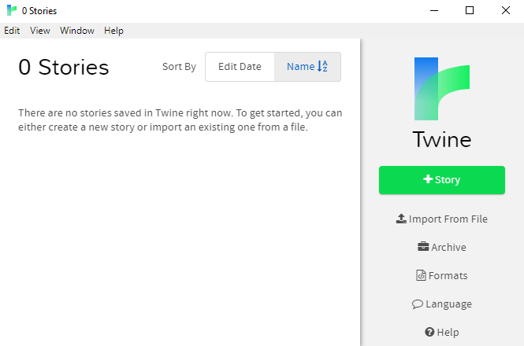
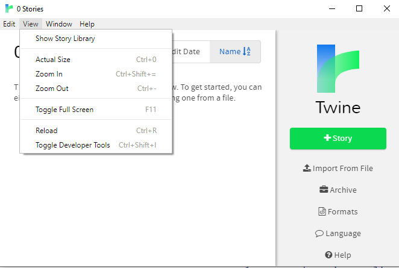
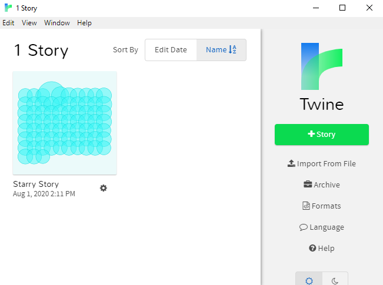
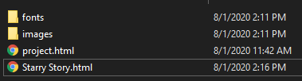
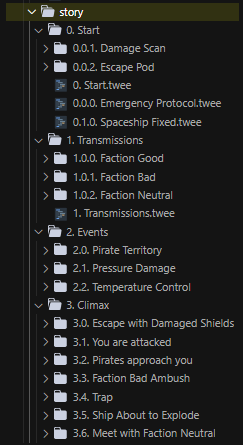

# Starry Story  documentation

## 📘 Instructions to modify and build story

1. First, clone the repository either by using a git client (sourcetree/git kraken), or by using the console.

       $ git clone https://github.com/Super-Lovers/star-lens-story

2. Open the repository and enter the ``dist`` folder and **copy all the contents** inside (images, fonts folders and project html file).

3. Go to the folder where Twine keeps its stories ("Documents > Twine > Stories" for me). If you don't know where that is, then:
  1. Start the Twine application:
  2. 
  3. Go to **View** in the menu bar and press Show Story Library, which will open the folder for you:
  4. 
  5. Paste the contents you copied in step **2** into the Show Story Library folder from step **3 and 4**
  6. Restart the Twine application and you should be able to see the story in the main menu:
  7. 
  8. You can now directly change the passages from the Twine application, however, you have to open the html file to play the story, rather than using Twine to play it. **You can change the story from the Application, but only play the story from the html file in the browser instead**.
  9. Twine will create an html file from the story automatically named after the name of the story: 
  
  10. After you have updated the story using the Twine application and tested it from the browser, you have to now write the tested/finished passages to the repository we cloned from **step 1**. Going back to the folder where you cloned the repository from step 1, enter the folder ``src`` then ``story`` and move the contents from the passages you wrote and tested in the Twine application to those passages' respective files, replicating the same code they had in the Twine application you wrote with:
  
  11. You can wait a minute for GitHub to build the application's new story and after that you can open it online from [here](https://super-lovers.github.io/star-lens-story/project.html) to see it and share it with others. **(If the changes don't appear right away, try F5 refreshing or CTRL-F5 refreshing)**.

